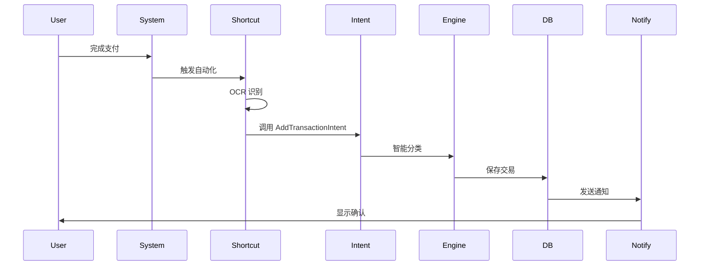
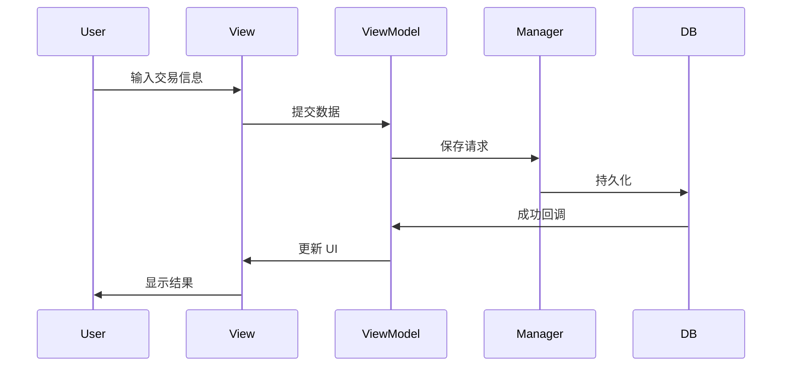

# 架构设计 Architecture Design

## 概述

无感记账 App 采用现代化的 iOS 架构设计，充分利用 SwiftUI、SwiftData 和 App Intents 框架的优势。

---

## 系统架构

### 分层架构

```
┌─────────────────────────────────────────────────────────┐
│                       用户层                              │
│  iOS 系统通知 | 快捷指令 | Siri | Widget | App 界面      │
└─────────────────────────────────────────────────────────┘
                            ↓
┌─────────────────────────────────────────────────────────┐
│                    集成层 (App Intents)                   │
│  AddTransactionIntent | QuickExpenseIntent               │
└─────────────────────────────────────────────────────────┘
                            ↓
┌─────────────────────────────────────────────────────────┐
│                     业务逻辑层                            │
│  CategoryEngine | DataManager | NotificationManager      │
└─────────────────────────────────────────────────────────┘
                            ↓
┌─────────────────────────────────────────────────────────┐
│                      数据层                               │
│  SwiftData | App Group Container | UserDefaults          │
└─────────────────────────────────────────────────────────┘
```

---

## 核心模块

### 1. 展示层 (Presentation Layer)

**技术**: SwiftUI + MVVM

#### Views
- **Onboarding**: 用户引导流程
- **Transaction**: 交易列表和详情
- **Statistics**: 数据统计和图表
- **Settings**: 应用设置

#### ViewModels
每个主要视图都有对应的 ViewModel：
- `TransactionListViewModel`
- `StatisticsViewModel`
- `OnboardingViewModel`

#### 职责
- UI 渲染和交互
- 用户输入处理
- 状态管理

---

### 2. 集成层 (Integration Layer)

**技术**: App Intents Framework

#### App Intents
- **AddTransactionIntent**: 添加交易记录
- **QuickExpenseIntent**: 快速记账（Siri）
- **ViewStatisticsIntent**: 查看统计（Widget）

#### Shortcuts
- 微信支付自动化
- 支付宝自动化
- 语音记账快捷方式

#### 职责
- 系统集成（Siri、快捷指令、Widget）
- 外部触发处理
- 后台任务执行

---

### 3. 业务逻辑层 (Business Logic Layer)

#### CategoryEngine (智能分类引擎)

**职责**:
- 商家名称 → 分类映射
- 规则匹配引擎
- 用户学习机制
- CoreML 模型集成（v2.0）

**算法策略**:
1. 用户规则优先
2. 预设规则匹配
3. 正则模式匹配
4. ML 模型推断
5. 默认分类

#### DataManager (数据管理器)

**职责**:
- 数据 CRUD 操作
- 事务管理
- 数据验证
- 缓存管理

**特性**:
- 单例模式
- 线程安全
- App Group 共享

#### NotificationManager (通知管理器)

**职责**:
- 推送通知
- 用户提醒
- 预算预警
- 通知交互处理

---

### 4. 数据层 (Data Layer)

#### SwiftData Models

```swift
@Model Transaction
@Model Category
@Model Budget
```

#### 数据存储策略

| 数据类型 | 存储方案 | 说明 |
|---------|---------|------|
| 交易记录 | SwiftData | 主要数据 |
| 分类配置 | SwiftData | 用户自定义 |
| 用户设置 | UserDefaults | 轻量配置 |
| 用户规则 | UserDefaults | 分类学习 |
| App Group | SQLite | Intent 共享 |

---

## 设计模式

### 1. MVVM (Model-View-ViewModel)

**应用场景**: SwiftUI 视图层

```swift
// Model
struct Transaction { }

// View
struct TransactionListView: View {
    @StateObject private var viewModel = TransactionListViewModel()
}

// ViewModel
class TransactionListViewModel: ObservableObject {
    @Published var transactions: [Transaction] = []

    func loadTransactions() { }
}
```

### 2. Singleton (单例模式)

**应用场景**: 全局服务

```swift
class DataManager {
    static let shared = DataManager()
    private init() { }
}

class CategoryEngine {
    static let shared = CategoryEngine()
    private init() { }
}
```

### 3. Strategy Pattern (策略模式)

**应用场景**: 分类推断

```swift
protocol ClassificationStrategy {
    func classify(merchant: String) -> Category
}

class RuleBasedStrategy: ClassificationStrategy { }
class MLBasedStrategy: ClassificationStrategy { }
class HybridStrategy: ClassificationStrategy { }
```

### 4. Repository Pattern (仓库模式)

**应用场景**: 数据访问抽象

```swift
protocol TransactionRepository {
    func fetch() async throws -> [Transaction]
    func save(_ transaction: Transaction) async throws
    func delete(_ transaction: Transaction) async throws
}

class SwiftDataTransactionRepository: TransactionRepository { }
```

---

## 数据流

### 自动记账流程



### 用户手动记账流程



---

## 并发模型

### Swift Concurrency (async/await)

```swift
// ViewModel 中使用
class TransactionListViewModel: ObservableObject {
    @Published var transactions: [Transaction] = []

    @MainActor
    func loadTransactions() async {
        do {
            transactions = try await dataManager.fetchTransactions()
        } catch {
            handleError(error)
        }
    }
}

// Intent 中使用
struct AddTransactionIntent: AppIntent {
    @MainActor
    func perform() async throws -> some IntentResult {
        try await dataManager.saveTransaction(transaction)
        return .result(dialog: "记账成功")
    }
}
```

---

## 依赖管理

### 依赖注入

```swift
// 使用 @Environment 注入依赖
struct TransactionListView: View {
    @Environment(\.modelContext) private var modelContext

    var body: some View {
        // ...
    }
}

// 使用构造函数注入（测试友好）
class TransactionListViewModel {
    private let dataManager: DataManager

    init(dataManager: DataManager = .shared) {
        self.dataManager = dataManager
    }
}
```

---

## 测试架构

### 测试金字塔

```
        ┌────────┐
        │ UI 测试 │  10%
        └────────┘
      ┌──────────────┐
      │  集成测试     │  20%
      └──────────────┘
   ┌──────────────────────┐
   │     单元测试          │  70%
   └──────────────────────┘
```

### 测试策略

| 层级 | 测试重点 | 工具 |
|-----|---------|------|
| 单元测试 | 业务逻辑、算法 | XCTest |
| 集成测试 | 模块协作 | XCTest |
| UI 测试 | 用户流程 | XCUITest |

---

## 性能优化

### 1. 数据加载优化

- **分页加载**: 交易列表按需加载
- **缓存机制**: 缓存常用查询结果
- **懒加载**: 图片和详情按需加载

### 2. UI 渲染优化

- **列表优化**: 使用 `LazyVStack`
- **图片优化**: 异步加载和缓存
- **动画优化**: 减少不必要的动画

### 3. 内存优化

- **弱引用**: 避免循环引用
- **资源释放**: 及时释放大对象
- **图片压缩**: 控制图片大小

---

## 安全性

### 1. 数据安全

- **本地存储加密**: 使用 iOS Data Protection
- **敏感数据**: 不存储支付密码
- **数据隔离**: App Group 隔离

### 2. 网络安全

- **HTTPS**: 所有网络请求使用 HTTPS
- **证书固定**: 防止中间人攻击
- **API 认证**: JWT Token 认证

### 3. 隐私保护

- **最小权限**: 只请求必要权限
- **本地处理**: OCR 在本地完成
- **数据透明**: 清晰的隐私政策

---

## 可扩展性

### 1. 新分类添加

```swift
// 只需在 CategoryEngine 中添加规则
categoryRules["新分类"] = ["关键词1", "关键词2"]
```

### 2. 新 Intent 添加

```swift
// 创建新的 Intent 文件
struct NewFeatureIntent: AppIntent {
    // 实现逻辑
}
```

### 3. 新存储源

```swift
// 实现 Repository 接口
class CloudKitRepository: TransactionRepository {
    // CloudKit 实现
}
```

---

## 未来架构演进

### Phase 1: 当前架构
- 单体应用
- 本地数据
- 规则引擎

### Phase 2: 云同步
- iCloud 集成
- 多设备同步
- 冲突解决

### Phase 3: AI 增强
- CoreML 集成
- 在线模型更新
- 个性化推荐

### Phase 4: 微服务化
- 后端服务
- API Gateway
- 实时同步

---

## 参考资料

- [Apple App Architecture](https://developer.apple.com/documentation/swift/app-architecture)
- [SwiftUI MVVM Best Practices](https://www.swiftbysundell.com/articles/swiftui-mvvm/)
- [App Intents Design Patterns](https://developer.apple.com/documentation/appintents/design-patterns)

---

*最后更新: 2024-11-18*
