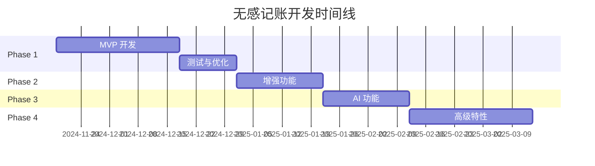

# 开发路线图 Development Roadmap

无感记账 App 的开发计划和里程碑

---

## 📅 总体规划

---

## 🎯 Phase 1: MVP (v1.0) - 3-4 周

**目标**: 发布可用的最小可行产品

### Week 1-2: 核心功能开发

#### ✅ 已完成
- [x] 项目初始化
- [x] 仓库文档设置
- [x] 开发规范制定

#### 🚧 进行中
- [ ] SwiftUI 项目搭建
- [ ] SwiftData 模型设计
- [ ] 基础数据模型实现
  - [ ] Transaction
  - [ ] Category
  - [ ] Budget

#### 📋 待开始
- [ ] App Intents 实现
  - [ ] AddTransactionIntent
  - [ ] QuickExpenseIntent
- [ ] 规则引擎开发
  - [ ] 基础分类规则
  - [ ] 关键词匹配
  - [ ] 正则表达式匹配
- [ ] 数据管理器
  - [ ] DataManager 实现
  - [ ] CRUD 操作
  - [ ] App Group 共享

### Week 3: UI 开发与集成

- [ ] 界面开发
  - [ ] 启动页
  - [ ] 交易列表
  - [ ] 交易详情
  - [ ] 添加交易
  - [ ] 统计页面（基础版）
  - [ ] 设置页面
- [ ] 用户引导流程
  - [ ] 欢迎页
  - [ ] 功能介绍
  - [ ] 快捷指令安装引导
  - [ ] 测试流程
- [ ] 通知系统
  - [ ] 确认通知
  - [ ] 通知交互
- [ ] 快捷指令模板
  - [ ] 微信支付模板
  - [ ] 支付宝模板

### Week 4: 测试与优化

- [ ] 功能测试
  - [ ] 单元测试覆盖核心逻辑
  - [ ] UI 测试主要流程
  - [ ] 集成测试
- [ ] 性能优化
  - [ ] 内存优化
  - [ ] 启动时间优化
  - [ ] 数据库查询优化
- [ ] Bug 修复
- [ ] 代码审查
- [ ] App Store 准备
  - [ ] 应用图标
  - [ ] 启动屏幕
  - [ ] 截图
  - [ ] 应用描述
  - [ ] 隐私政策

**交付物**:
- ✅ 基础自动记账功能
- ✅ 智能分类（规则引擎）
- ✅ 交易管理
- ✅ 基础统计
- ✅ 用户引导
- ✅ 通知反馈

---

## 🚀 Phase 2: 增强功能 (v1.5) - 2-3 周

**目标**: 提升用户体验和功能完整性

### 功能列表

#### 多账本管理
- [ ] 账本数据模型
- [ ] 账本创建/编辑/删除
- [ ] 账本切换
- [ ] 账本统计独立

#### 预算管理
- [ ] 预算设置（按分类）
- [ ] 预算进度显示
- [ ] 超支预警
- [ ] 预算历史

#### 数据可视化
- [ ] 图表库集成 (Swift Charts)
- [ ] 支出趋势图
- [ ] 分类饼图
- [ ] 月度对比图
- [ ] 交互式图表

#### Widget 小组件
- [ ] 小组件 Extension
- [ ] 今日支出小组件
- [ ] 月度预算小组件
- [ ] 最近交易小组件
- [ ] 配置 Intent

#### 数据导出
- [ ] CSV 导出
- [ ] Excel 导出
- [ ] PDF 报告生成
- [ ] 分享功能

#### iCloud 同步
- [ ] CloudKit 集成
- [ ] 数据同步逻辑
- [ ] 冲突解决
- [ ] 同步状态显示

**交付物**:
- ✅ 更强大的数据管理
- ✅ 丰富的可视化
- ✅ 多设备同步
- ✅ 数据导出能力

---

## 🤖 Phase 3: AI 功能 (v2.0) - 2-3 周

**目标**: 引入机器学习提升智能化

### CoreML 智能分类

#### 数据准备
- [ ] 收集用户修正数据
- [ ] 数据清洗和标注
- [ ] 训练集/测试集分割

#### 模型训练
- [ ] Create ML 训练脚本
- [ ] 文本分类模型
- [ ] 模型评估和优化
- [ ] 模型导出

#### 模型集成
- [ ] MLModel 加载
- [ ] 推理逻辑
- [ ] 混合策略（Rule + ML）
- [ ] 降级方案

### AI 对话记账
- [ ] 自然语言处理
- [ ] 对话界面
- [ ] 语义理解
- [ ] 上下文记忆

### OCR 小票扫描
- [ ] Vision 框架集成
- [ ] 文本识别
- [ ] 信息提取
- [ ] 结构化数据

### Siri 语音记账
- [ ] SiriKit 集成
- [ ] 自定义语音短语
- [ ] 语音反馈
- [ ] 快捷指令增强

**交付物**:
- ✅ AI 智能分类
- ✅ 对话式记账
- ✅ 小票扫描
- ✅ 语音交互

---

## 🎨 Phase 4: 高级特性 (v2.5+) - 持续迭代

**目标**: 提供更多高级功能和更好的体验

### Control Center 控件
- [ ] iOS 18 Controls API
- [ ] 快速记账控件
- [ ] 查看统计控件

### Apple Watch 支持
- [ ] watchOS App
- [ ] Complication 表盘
- [ ] 快速记账
- [ ] 数据同步

### 多人协作账本
- [ ] 账本共享
- [ ] 权限管理
- [ ] 实时同步
- [ ] 评论功能

### 订阅管理
- [ ] 周期性支出识别
- [ ] 订阅提醒
- [ ] 订阅分析
- [ ] 取消建议

### 消费分析报告
- [ ] AI 消费洞察
- [ ] 月度报告
- [ ] 异常检测
- [ ] 节省建议

### Live Activities
- [ ] 实时活动支持
- [ ] 记账进度
- [ ] 预算提醒

### Shortcuts Actions
- [ ] 更多 Shortcut 操作
- [ ] 查询交易
- [ ] 统计分析
- [ ] 预算查询

**交付物**:
- ✅ 系统深度集成
- ✅ 多设备支持
- ✅ 协作功能
- ✅ 智能分析

---

## 📊 功能优先级矩阵

### 高优先级（必须有）
- ✅ 自动记账
- ✅ 智能分类
- ✅ 交易管理
- ✅ 基础统计
- ✅ 数据存储

### 中优先级（应该有）
- 🔄 多账本
- 🔄 预算管理
- 🔄 数据可视化
- 🔄 Widget
- 🔄 iCloud 同步

### 低优先级（可以有）
- ⏳ AI 对话
- ⏳ OCR 扫描
- ⏳ Apple Watch
- ⏳ 多人协作
- ⏳ Live Activities

---

## 🎯 里程碑

### Milestone 1: MVP 发布 (v1.0)
**目标日期**: 2024-12-31
- 核心自动记账功能
- App Store 上线
- 获取首批用户反馈

### Milestone 2: 功能完善 (v1.5)
**目标日期**: 2025-01-31
- 多账本和预算管理
- Widget 和数据导出
- 用户数达到 1000+

### Milestone 3: AI 增强 (v2.0)
**目标日期**: 2025-03-31
- CoreML 智能分类
- Siri 和 OCR 功能
- 用户数达到 5000+

### Milestone 4: 生态完善 (v2.5)
**目标日期**: 2025-06-30
- 多设备支持
- 协作功能
- 用户数达到 10000+

---

## 📈 成功指标

### 技术指标
- [ ] 代码测试覆盖率 > 70%
- [ ] 启动时间 < 1 秒
- [ ] Crash-free 率 > 99%
- [ ] App Store 评分 > 4.5

### 用户指标
- [ ] 日活用户 (DAU) > 500
- [ ] 月活用户 (MAU) > 2000
- [ ] 用户留存率 (D7) > 40%
- [ ] 平均每日记账次数 > 3

### 业务指标
- [ ] App Store 下载量 > 10000
- [ ] 付费用户转化率 > 5%
- [ ] 用户 NPS 评分 > 50

---

## 🔄 迭代策略

### 快速迭代
- 2 周一个小版本
- 每月一个中版本
- 每季度一个大版本

### 用户反馈驱动
- 收集用户反馈
- 数据分析优化
- A/B 测试新功能
- 持续改进

### 技术债务管理
- 每个迭代预留 20% 时间
- 重构和优化
- 文档更新
- 测试补充

---

## 📝 版本命名

遵循 [Semantic Versioning](https://semver.org/)

- **Major**: 重大架构变更或不兼容更新
- **Minor**: 新功能添加
- **Patch**: Bug 修复和小优化

示例:
- `1.0.0` - MVP 发布
- `1.1.0` - 添加多账本
- `1.1.1` - 修复分类 Bug
- `2.0.0` - AI 功能上线

---

## 🤝 贡献

欢迎参与开发路线图的讨论！

- 提出新功能建议: [Issues](https://github.com/XiaoLinZzz/Record-Money/issues)
- 参与优先级投票: [Discussions](https://github.com/XiaoLinZzz/Record-Money/discussions)

---

*路线图会根据用户反馈和技术发展持续更新*

*最后更新: 2024-11-18*
