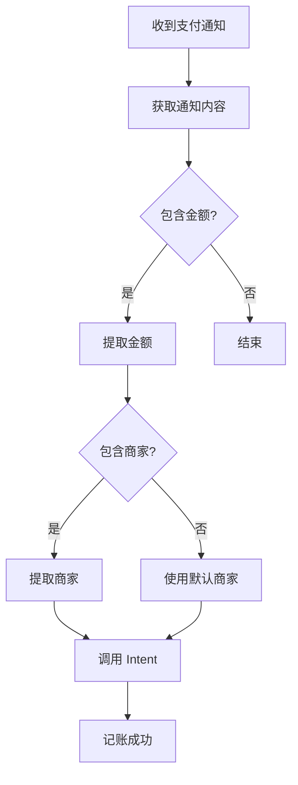

# 快捷指令配置指南（通知触发版）

本指南详细说明如何配置 iOS 快捷指令，通过**捕获支付成功通知**实现自动记账功能。

---

## 📱 核心原理

当你在任意 App（淘宝、美团、京东等）使用微信或支付宝支付后：

```
用户在第三方 App 中支付
    ↓
唤起微信/支付宝完成支付
    ↓
支付成功，iOS 弹出通知横幅
    例如："微信支付：向星巴克付款 ¥35.00"
    ↓
快捷指令自动化捕获通知 ⚡
    ↓
从通知文本提取金额、商家
    ↓
调用无感记账 App Intent
    ↓
自动保存 + 智能分类
    ↓
推送确认通知 ✅
```

**优势**：
- ✅ 不依赖打开特定 App
- ✅ 更精准（只在支付成功时触发）
- ✅ 更轻量（不需要截图）
- ✅ 支持所有使用微信/支付宝的支付场景

---

## 🚀 微信支付自动化配置

### 步骤 1: 打开快捷指令 App

1. 在 iPhone 主屏幕找到"快捷指令" App
2. 如果没有，从 App Store 下载（iOS 系统自带）

### 步骤 2: 创建个人自动化

1. 点击底部"自动化"标签
2. 点击右上角 "+" 号
3. 选择"创建个人自动化"

### 步骤 3: 设置触发条件 - 通知到达

1. **选择触发器**：下滑找到"通知"，点击"通知"
2. **选择 App**：点击"选取" → 搜索并选择"微信"
3. **设置条件**（重要！）：
   - 点击"立即运行"下方的"包含"
   - 输入关键词：`支付成功` 或 `付款成功`

   > 这样只有包含"支付成功"字样的通知才会触发

4. 点击"下一步"

### 步骤 4: 添加操作 - 提取信息并记账

#### 操作 1: 获取通知内容

```
• 搜索: "通知"
• 添加"获取通知内容"操作
• 输入: 自动化输入（通知详情）
```

**作用**: 获取通知的标题和正文

#### 操作 2: 提取金额

**方式 A：使用"匹配文本"（推荐）**

```
• 搜索: "匹配文本"
• 添加"匹配文本"操作
• 文本: 通知内容
• 模式: ¥?(\d+\.?\d+)
• 勾选"正则表达式"
```

**方式 B：使用"从输入中获取"（简单版）**

```
• 搜索: "获取变量"
• 选择"从通知内容中获取"
• 类型: 数字
```

#### 操作 3: 提取商家名称（可选，如果通知包含）

```
• 搜索: "匹配文本"
• 添加"匹配文本"操作
• 文本: 通知内容
• 模式: 向(.+?)付款|收款方[:：](.+)
• 勾选"正则表达式"
```

#### 操作 4: 调用 App Intent

```
• 搜索: "添加交易记录"
• 选择"无感记账 - 添加交易记录" Intent
• 配置参数:
  - 金额: [匹配到的金额]
  - 商家名称: [匹配到的商家] 或 "微信支付"
  - 交易类型: 支出
  - 原始文本: [通知内容]
  - 支付方式: "微信支付"
```

### 步骤 5: 完成设置

1. 点击"下一步"
2. **关闭"运行前询问"**（⚠️ 非常重要！）
3. **关闭"运行时通知"**（避免重复通知）
4. 点击"完成"

---

## 💰 支付宝自动化配置

### 步骤 1-2: 同微信

参考微信配置的步骤 1-2

### 步骤 3: 设置触发条件

1. **选择触发器**："通知"
2. **选择 App**："支付宝"
3. **设置条件**：
   - 包含关键词：`付款成功` 或 `支付成功`

### 步骤 4: 添加操作

支付宝通知文本格式示例：
```
支付宝
付款成功
向星巴克付款 ¥35.00
```

#### 提取金额

```
模式: ¥?(\d+\.?\d+)
```

#### 提取商家

```
模式: 向(.+?)付款
```

#### Intent 配置

```
• 金额: [匹配到的金额]
• 商家名称: [匹配到的商家]
• 交易类型: 支出
• 原始文本: [通知内容]
• 支付方式: "支付宝"
```

---

## 📝 通知文本格式参考

### 微信支付通知格式

**格式 1**（常见）：
```
微信支付
支付成功
向[商家名称]付款 ¥35.00
```

**格式 2**：
```
微信支付
¥35.00
收款方: 星巴克
```

**格式 3**（转账）：
```
微信支付
转账成功
转账给张三 ¥100.00
```

### 支付宝通知格式

**格式 1**：
```
支付宝
付款成功
向星巴克付款 ¥35.00
```

**格式 2**：
```
支付宝
支付成功 ¥35.00
商家: 星巴克
```

---

## 🎯 完整快捷指令流程

### 简化版（推荐新手）

```
触发: 收到微信/支付宝通知，且包含"支付成功"
    ↓
操作 1: 获取通知内容
    ↓
操作 2: 匹配金额 (¥?\d+\.?\d+)
    ↓
操作 3: 匹配商家 (向(.+?)付款)
    ↓
操作 4: 调用"添加交易记录" Intent
    参数：
    - 金额: [匹配结果 1]
    - 商家: [匹配结果 2] 或 "未知商家"
    - 类型: 支出
    - 支付方式: "微信支付"
    ↓
完成！
```

### 完整版（包含异常处理）



---

## 📋 正则表达式模板

### 通用金额匹配

| 模式 | 说明 | 示例 |
|-----|------|------|
| `¥?(\d+\.?\d+)` | 基础匹配 | ¥35.00, 35.00, 35 |
| `¥(\d+\.\d{2})` | 严格两位小数 | ¥35.00 |
| `[¥￥]?(\d{1,6}(?:\.\d{2})?)` | 限制范围 | ¥0.01 - ¥999999.99 |

### 商家名称匹配

| 模式 | 说明 | 适用场景 |
|-----|------|---------|
| `向(.+?)付款` | 微信常用格式 | 向星巴克付款 |
| `收款方[:：](.+)` | 微信详情页 | 收款方：星巴克 |
| `商家[:：](.+)` | 支付宝 | 商家：星巴克 |
| `转账给(.+?)\s` | 转账 | 转账给张三 |

---

## ⚠️ 常见问题

### Q1: 自动化没有触发

**检查清单:**
- [ ] 自动化是否已启用
- [ ] "运行前询问"是否已**关闭**
- [ ] 关键词是否正确（"支付成功" 或 "付款成功"）
- [ ] 微信/支付宝通知权限是否开启

**验证方法:**
```
1. 手动进行一次小额支付（0.01 元转账）
2. 观察是否收到通知
3. 检查快捷指令是否运行
4. 如未运行，检查自动化日志
```

**打开通知权限:**
```
设置 → 通知 → 微信/支付宝
→ 允许通知 ✅
→ 横幅 ✅
```

### Q2: 能触发但提取不到金额

**原因**: 通知文本格式可能不同

**调试方法:**
```
1. 创建一个测试快捷指令
2. 触发器: 收到微信通知
3. 操作:
   - 获取通知内容
   - 显示通知（标题: 调试，内容: [通知内容]）
4. 支付一次，查看实际的通知文本
5. 根据实际文本调整正则表达式
```

**示例调试快捷指令:**
```
触发: 收到微信通知（包含"支付"）
操作:
  1. 获取通知内容
  2. 添加到备忘录
     标题: 通知调试
     内容: [当前日期] [通知内容]
```

### Q3: 提取到了但金额不对

**可能原因:**
- 匹配到了其他数字（如订单号）
- 通知中有多个金额

**解决方案:**
```swift
// 更精确的匹配
¥([1-9]\d{0,5}\.\d{2}|0\.\d{2})

// 说明:
// - 必须以 ¥ 开头
// - 排除 0 元
// - 必须有两位小数
```

### Q4: Intent 找不到

**解决方案:**
1. 确保无感记账 App 已安装
2. 打开 App 至少一次
3. 进入 App 的设置页面
4. 重启 iPhone
5. 重新搜索"添加交易记录"

### Q5: 每次都要手动确认

**原因**: 未关闭"运行前询问"

**解决方案:**
```
1. 打开"快捷指令" App
2. 点击"自动化"
3. 找到你的自动化
4. 点击右上角"..."
5. 关闭"运行前询问" ✅
6. 关闭"运行时通知"（可选）
```

### Q6: 通知权限总是询问

**原因**: 快捷指令首次运行需要权限

**解决方案:**
```
首次触发时:
1. 允许访问通知 ✅
2. 勾选"始终允许" ✅

如果每次都问:
设置 → 快捷指令 → 专用访问权限
→ 允许访问通知 ✅
```

---

## 🔍 调试技巧

### 方法 1: 通知内容日志

在每个关键步骤后添加"显示通知"或"添加到备忘录"：

```
操作:
1. 获取通知内容
2. 添加到备忘录
   标题: 通知记录
   内容:
     时间: [当前日期]
     原始文本: [通知内容]
     提取金额: [匹配结果]
     提取商家: [匹配结果]
```

### 方法 2: 分步测试

**Step 1: 测试触发**
```
触发: 收到微信通知（包含"支付"）
操作: 显示通知（内容: "触发成功"）
```

**Step 2: 测试提取金额**
```
触发: 收到微信通知（包含"支付"）
操作:
  1. 获取通知内容
  2. 匹配文本（¥?\d+\.?\d+）
  3. 显示通知（内容: [匹配结果]）
```

**Step 3: 测试提取商家**
```
同上，测试商家匹配
```

**Step 4: 测试 Intent 调用**
```
完整流程
```

### 方法 3: 使用"快速查看"

```
在关键步骤添加"快速查看"：
1. 获取通知内容 → 快速查看
2. 匹配金额 → 快速查看
3. 匹配商家 → 快速查看
```

---

## 🎓 进阶技巧

### 技巧 1: 智能识别转账 vs 消费

```
if 通知内容 包含 "转账"
  then 商家 = "转账"
  else 商家 = [提取的商家]
```

### 技巧 2: 过滤小额支付

```
if 金额 < 1
  then 不记账（避免记录红包等）
  else 调用 Intent
```

### 技巧 3: 多支付方式合并

创建一个"中转快捷指令"：

```
快捷指令名称: 统一记账

输入参数:
  - 金额
  - 商家
  - 支付方式

操作:
  调用"添加交易记录" Intent
```

然后微信和支付宝自动化都调用这个快捷指令。

### 技巧 4: 自定义分类关键词

在 Intent 的"原始文本"参数中传入完整通知内容，CategoryEngine 会分析并学习。

---

## 🔐 隐私与安全

### 数据流向

```
微信/支付宝通知
    ↓（iOS 系统）
通知中心
    ↓（本地读取）
快捷指令
    ↓（本地调用）
无感记账 App Intent
    ↓（本地存储）
iPhone 本地数据库
```

**保证**: 所有数据处理都在本地完成，不会上传到任何服务器。

### 权限说明

| 权限 | 用途 | 是否必需 |
|-----|------|---------|
| 通知访问 | 读取支付通知 | ✅ 必需 |
| 后台运行 | 自动化执行 | ✅ 必需 |
| App Intent | 调用记账功能 | ✅ 必需 |

### 安全建议

1. ✅ 只授权快捷指令访问通知
2. ✅ 不要分享包含敏感信息的自动化
3. ✅ 定期检查自动化列表
4. ✅ 使用 Face ID/Touch ID 保护 App

---

## 📦 快捷指令模板示例

### 微信支付完整模板

```
名称: 微信支付自动记账

触发器:
  - 类型: 通知
  - App: 微信
  - 包含: "支付成功"
  - 立即运行

操作:
  1. 获取通知内容
     输入: 自动化输入

  2. 匹配文本
     文本: 通知内容
     模式: ¥?(\d+\.?\d+)
     正则表达式: 开

  3. 匹配文本
     文本: 通知内容
     模式: 向(.+?)付款
     正则表达式: 开

  4. if 匹配的文本 存在
     then:
       设定变量 "商家" = 匹配的文本
     otherwise:
       设定变量 "商家" = "微信支付"

  5. 添加交易记录 (无感记账)
     金额: [第一个匹配结果]
     商家: [变量:商家]
     类型: 支出
     原始文本: [通知内容]
     支付方式: "微信支付"

设置:
  - 运行前询问: 关
  - 运行时通知: 关
```

---

## 📞 获取帮助

### 问题反馈

- **GitHub Issues**: https://github.com/XiaoLinZzz/Record-Money/issues
- **Email**: support@autobookkeeping.com

### 视频教程

[待添加] 配置演示视频链接

---

## 📜 更新日志

### v1.1 (2024-11-18)
- ✅ **修正触发方式**：改为基于通知触发
- ✅ 更轻量（不需要截图）
- ✅ 更准确（只在支付成功时触发）
- ✅ 支持所有支付场景

### v1.0 (2024-11-18)
- ❌ 旧版（基于 App 打开触发，已废弃）

---

**祝你使用愉快！有问题随时反馈。** 🎉
