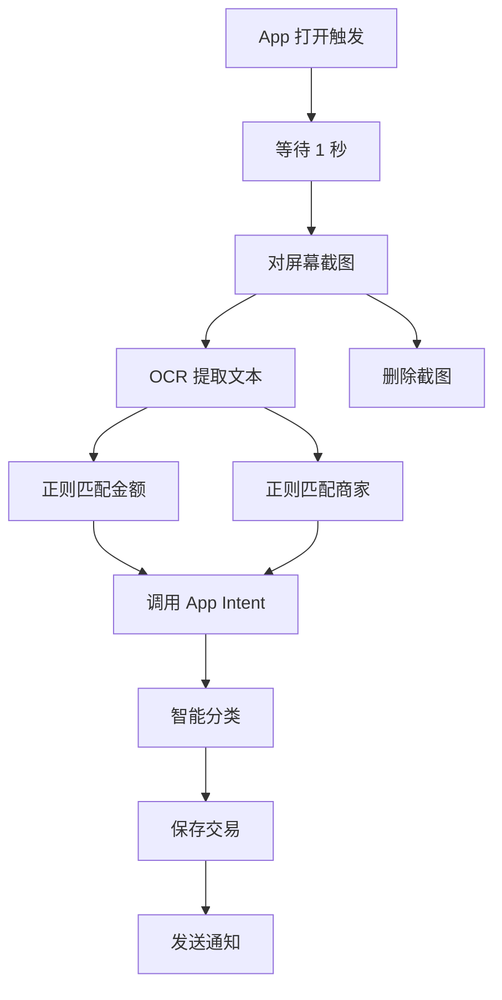

# 快捷指令配置指南

本指南详细说明如何配置 iOS 快捷指令，实现支付后自动记账功能。

---

## 📱 核心原理

当你在微信或支付宝完成支付后：

```
支付完成 → 微信/支付宝 App 打开
    ↓
iOS 快捷指令自动化触发
    ↓
截图支付页面
    ↓
Live Text OCR 识别文本
    ↓
提取金额、商家等信息
    ↓
调用无感记账 App Intent
    ↓
自动保存 + 智能分类
    ↓
推送确认通知
```

---

## 🚀 微信支付自动化配置

### 步骤 1: 打开快捷指令 App

1. 在 iPhone 主屏幕找到"快捷指令" App
2. 如果没有，从 App Store 下载（iOS 系统自带）

### 步骤 2: 创建个人自动化

1. 点击底部"自动化"标签
2. 点击右上角 "+" 号
3. 选择"创建个人自动化"

### 步骤 3: 设置触发条件

1. 选择"App"
2. 点击"选取" → 搜索并选择"微信"
3. 触发时机选择"已打开"
4. 取消勾选"已关闭"
5. 点击"下一步"

### 步骤 4: 添加操作

#### 操作 1: 等待

```
• 搜索: "等待"
• 添加"等待" 操作
• 设置时间: 1 秒
```

**作用**: 等待微信支付页面完全显示

#### 操作 2: 截图

```
• 搜索: "截图"
• 添加"对屏幕截图" 操作
```

**作用**: 捕获支付成功页面

#### 操作 3: OCR 识别

```
• 搜索: "获取文本"
• 添加"从图像获取文本" 操作
• 输入选择: "屏幕截图"
```

**作用**: 提取页面中的所有文字

#### 操作 4: 提取金额

```
• 搜索: "匹配文本"
• 添加"匹配文本" 操作
• 模式: ¥(\d+\.?\d*)
• 启用"正则表达式"
```

**作用**: 从文本中提取金额（格式如 ¥35.00）

#### 操作 5: 提取商家名称

```
• 搜索: "匹配文本"
• 添加"匹配文本" 操作
• 模式: 收款方[:：]\s*(.+)
• 启用"正则表达式"
```

**作用**: 提取商家名称

#### 操作 6: 调用 App Intent

```
• 搜索: "添加交易记录"
• 添加"无感记账 - 添加交易记录" Intent
• 配置参数:
  - 金额: [匹配到的金额]
  - 商家名称: [匹配到的商家]
  - 交易类型: 支出
  - 原始文本: [图像获取的文本]
  - 支付方式: "微信支付"
```

#### 操作 7: 删除截图（可选）

```
• 搜索: "删除照片"
• 添加"删除照片" 操作
• 输入: "屏幕截图"
• 确认删除: 不询问
```

**作用**: 清理临时截图，节省空间

### 步骤 5: 完成设置

1. 点击"下一步"
2. **关闭"运行前询问"**（重要！）
3. 点击"完成"

---

## 💰 支付宝自动化配置

### 步骤 1-3: 同微信

参考微信配置的步骤 1-3，但选择"支付宝" App

### 步骤 4: 添加操作

支付宝的文本提取规则略有不同：

#### 金额提取

```
模式: 付款金额\s*¥?(\d+\.?\d*)
```

#### 商家名称提取

```
模式: 商家名称[:：]\s*(.+)
```

#### Intent 配置

```
• 金额: [匹配到的金额]
• 商家名称: [匹配到的商家]
• 交易类型: 支出
• 原始文本: [图像获取的文本]
• 支付方式: "支付宝"
```

其余步骤完全相同。

---

## 🎯 完整快捷指令流程图



---

## 📝 正则表达式模板

### 微信支付

| 字段 | 正则表达式 | 示例 |
|-----|-----------|------|
| 金额 | `¥(\d+\.?\d*)` | ¥35.00 |
| 商家 | `收款方[:：]\s*(.+)` | 收款方: 星巴克 |
| 交易号 | `交易单号[:：]\s*(\d+)` | 交易单号: 123456789 |

### 支付宝

| 字段 | 正则表达式 | 示例 |
|-----|-----------|------|
| 金额 | `付款金额\s*¥?(\d+\.?\d*)` | 付款金额 35.00 |
| 商家 | `商家名称[:：]\s*(.+)` | 商家名称：星巴克 |
| 订单号 | `订单号[:：]\s*(\d+)` | 订单号：987654321 |

### 云闪付

| 字段 | 正则表达式 | 示例 |
|-----|-----------|------|
| 金额 | `交易金额[:：]\s*¥?(\d+\.?\d*)` | 交易金额：35.00 |
| 商家 | `商户名称[:：]\s*(.+)` | 商户名称：星巴克 |

---

## ⚠️ 常见问题

### Q1: 自动化没有触发

**检查清单:**
- [ ] 自动化是否已启用
- [ ] "运行前询问"是否已关闭
- [ ] 触发条件是否正确（App + 已打开）
- [ ] iOS 系统版本是否 ≥ 16.0

**解决方案:**
```
设置 → 快捷指令 → 高级
→ 允许运行自动化
```

### Q2: 提取不到金额或商家

**原因**: 不同版本的微信/支付宝页面文本格式可能不同

**解决方案:**
1. 完成一次支付
2. 手动截图支付成功页面
3. 使用"实况文本"查看 OCR 结果
4. 根据实际文本调整正则表达式

**示例调试:**
```
1. 打开快捷指令 App
2. 找到自动化
3. 点击编辑
4. 在"从图像获取文本"后添加"快速查看"
5. 手动运行，查看提取的文本
6. 调整正则表达式
```

### Q3: 总是弹出权限请求

**原因**: 快捷指令需要访问照片、剪贴板等

**解决方案:**
```
首次运行时:
1. 允许访问照片
2. 允许使用剪贴板
3. 允许发送通知

勾选"始终允许"
```

### Q4: Intent 找不到

**原因**: App 未正确注册 Intent

**解决方案:**
1. 确保无感记账 App 已安装
2. 打开 App 至少一次
3. 重启 iPhone
4. 重新搜索 Intent

### Q5: 记账金额不正确

**原因**: 正则匹配到了错误的数字

**优化方案:**
```swift
// 更精确的金额匹配
¥([1-9]\d{0,5}\.\d{2}|[1-9]\d{0,5}|0\.\d{2})

// 说明:
// - 排除 ¥0
// - 确保小数点后有 2 位
// - 金额范围: 0.01 - 999999.99
```

---

## 🔍 调试技巧

### 方法 1: 快速查看

在每个关键步骤后添加"快速查看"操作：

```
1. 从图像获取文本 → 快速查看 → 查看提取的文本
2. 匹配文本(金额) → 快速查看 → 查看匹配结果
3. 匹配文本(商家) → 快速查看 → 查看匹配结果
```

### 方法 2: 日志记录

添加"添加到备忘录"操作记录调试信息：

```
• 操作: 添加到备忘录
• 内容:
  时间: [当前日期]
  原始文本: [OCR 文本]
  金额: [匹配结果]
  商家: [匹配结果]
```

### 方法 3: 通知提示

添加"显示通知"查看中间结果：

```
• 操作: 显示通知
• 标题: 调试信息
• 正文: 金额: [金额] | 商家: [商家]
```

---

## 📦 快捷指令模板下载

### 微信支付模板

```
[快捷指令链接将在 App Store 上线后提供]
```

### 支付宝模板

```
[快捷指令链接将在 App Store 上线后提供]
```

### 云闪付模板

```
[快捷指令链接将在 App Store 上线后提供]
```

---

## 🎓 进阶技巧

### 技巧 1: 条件判断

只在金额 > 0 时记账：

```
• 添加"if"条件
• 条件: 匹配的文本 > 0
• 是: 调用 Intent
• 否: 不执行任何操作
```

### 技巧 2: 自动分类优化

在 Intent 中传入更多上下文：

```
• 原始文本: 完整的 OCR 文本
• 用途: CategoryEngine 分析时会更准确
```

### 技巧 3: 多账本支持（v1.5+）

根据支付方式选择账本：

```
• 微信支付 → 个人账本
• 支付宝（公司账号）→ 公司账本
```

### 技巧 4: 批量处理

从截图文件夹批量导入历史支付记录：

```
1. 选择相册中的截图
2. 批量 OCR
3. 循环调用 Intent
```

---

## 🔐 隐私与安全

### 数据流向

```
微信/支付宝支付页面
    ↓（本地截图）
iOS 照片库
    ↓（本地 OCR）
快捷指令
    ↓（本地调用）
无感记账 App
    ↓（本地存储）
iPhone 本地数据库
```

**保证**: 所有数据处理都在本地完成，不会上传到任何服务器。

### 权限说明

| 权限 | 用途 | 是否必需 |
|-----|------|---------|
| 照片访问 | 截图和 OCR | ✅ 必需 |
| 通知 | 记账确认提示 | ✅ 推荐 |
| 剪贴板 | 数据传递 | ✅ 必需 |

### 安全建议

1. ✅ 定期清理快捷指令产生的截图
2. ✅ 不要分享包含敏感信息的快捷指令
3. ✅ 定期检查自动化列表
4. ✅ 使用 Face ID/Touch ID 保护 App

---

## 📞 获取帮助

### 问题反馈

- **GitHub Issues**: https://github.com/XiaoLinZzz/Record-Money/issues
- **Email**: support@autobookkeeping.com

### 视频教程

[待添加] 配置演示视频链接

### 社区支持

[待添加] 用户社区链接

---

## 📜 更新日志

### v1.0 (2024-11-18)
- ✅ 初始版本
- ✅ 支持微信支付
- ✅ 支持支付宝
- ✅ 基础 OCR 识别

### v1.1 (计划中)
- 📋 支持云闪付
- 📋 优化正则表达式
- 📋 添加更多调试工具

---

**祝你使用愉快！有问题随时反馈。** 🎉
