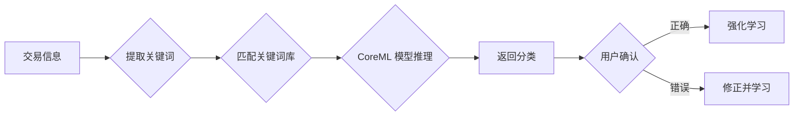

# 分类管理

分类是 AutoBookkeeping 中组织交易记录的重要方式。合理的分类设置能帮助你更好地了解消费结构和理财习惯。

## 📁 什么是分类

**分类（Category）** 是给交易记录打的标签，用来标识这笔钱花在什么方面。比如：

- 🍜 **餐饮美食** - 吃饭、外卖、咖啡
- 🚗 **交通出行** - 地铁、打车、加油
- 🛒 **购物消费** - 衣服、日用品、电子产品

通过分类，你可以清楚地看到每个月在各个方面的花费。

## 🎨 系统预设分类

AutoBookkeeping 内置了常用的分类，开箱即用。

### 支出分类

**🍜 餐饮美食**
- 早餐、午餐、晚餐
- 快餐、外卖
- 咖啡、饮料、甜点

**🚗 交通出行**
- 地铁、公交、出租车
- 共享单车、网约车
- 加油、停车费

**🛒 购物消费**
- 服装鞋帽
- 日用百货
- 数码电子

**🏠 居住缴费**
- 房租、房贷
- 水电燃气
- 物业费、宽带费

**📱 通讯网络**
- 话费充值
- 流量套餐
- 宽带费用

**🎬 文娱休闲**
- 电影、演出
- 游戏、书籍
- 健身、运动

**💊 医疗健康**
- 看病、买药
- 体检、保健
- 医疗保险

**📚 学习教育**
- 课程培训
- 图书资料
- 考试报名

**✈️ 旅游度假**
- 机票、火车票
- 酒店住宿
- 景点门票

**👪 人情往来**
- 红包、礼金
- 请客吃饭
- 礼品

**💰 其他支出**
- 未分类的支出

### 收入分类

- 💼 **工资收入** - 固定工资、奖金、提成
- 📈 **投资理财** - 股票、基金、理财收益
- 💸 **兼职收入** - 副业、外快、咨询费
- 🎁 **红包礼金** - 收到的红包、礼金
- 💰 **其他收入** - 其他来源的收入

## ➕ 自定义分类

除了系统预设，你可以创建符合自己需求的分类。

### 创建新分类

1. **进入分类管理**
   - 打开 **设置** 标签
   - 点击 **分类管理**

2. **添加分类**
   - 点击右上角 **[+]** 按钮
   - 或点击 **添加自定义分类**

3. **设置分类信息**

| 设置项 | 说明 | 示例 |
|--------|------|------|
| 📝 名称 | 分类的名称（必填） | "宠物开销" |
| 🎨 图标 | 从 100+ 图标中选择 | 🐶 |
| 🌈 颜色 | 分类的主题颜色 | 橙色 |
| 📊 类型 | 支出或收入 | 支出 |
| 🔤 关键词 | 帮助 AI 识别（可选） | 猫粮,狗粮,宠物医院 |

4. **保存**
   - 点击 **保存** 完成创建
   - 新分类立即可用

### 自定义分类示例

**宠物开销** 🐾
- 图标：🐶
- 颜色：橙色
- 关键词：宠物、猫粮、狗粮、宠物医院

**游戏充值** 🎮
- 图标：🎮
- 颜色：紫色
- 关键词：游戏、充值、皮肤

**美容护肤** 💄
- 图标：💄
- 颜色：粉色
- 关键词：化妆品、护肤、美容院

## ✏️ 编辑分类

### 修改系统分类

系统预设分类可以修改：

**可修改**：
- ✅ 分类图标
- ✅ 分类颜色
- ✅ 关键词

**不可修改**：
- ❌ 分类名称
- ❌ 分类类型（支出/收入）

### 修改自定义分类

自定义分类可以完全修改：

1. 在分类列表中找到目标分类
2. 点击分类卡片
3. 修改任意字段
4. 点击 **保存**

::: warning 注意
修改分类后，已有的交易记录不会自动更新。如需批量修改，请使用"批量编辑"功能。
:::

## 🗑️ 删除分类

### 删除限制

**不可删除**：
- ❌ 系统预设分类
- ❌ 有交易记录的分类

**可删除**：
- ✅ 无交易记录的自定义分类

### 删除步骤

1. 进入 **分类管理**
2. 向左滑动分类卡片
3. 点击 **删除** 按钮
4. 确认删除

### 处理有记录的分类

如果想删除有记录的分类：

**方式一：转移记录**
1. 批量选择该分类的所有记录
2. 修改为其他分类
3. 然后删除空分类

**方式二：隐藏分类**（推荐）
1. 将分类标记为"已归档"
2. 分类不再显示在选择列表
3. 历史记录保持不变

## 🔤 关键词设置

关键词帮助 AI 更准确地识别分类。

### 什么是关键词

当交易描述中包含某个关键词时，AI 会优先选择对应的分类。

**示例**：

| 分类 | 关键词 | 匹配示例 |
|------|--------|----------|
| 餐饮美食 | 麦当劳,肯德基,星巴克 | "在麦当劳吃午饭" |
| 交通出行 | 地铁,打车,滴滴 | "滴滴打车去公司" |
| 宠物开销 | 宠物,猫粮,狗粮 | "买了一袋猫粮" |

### 设置关键词

1. 进入分类编辑页面
2. 找到 **关键词** 字段
3. 输入关键词，用逗号分隔
4. 保存

**技巧**：
- 📝 使用常见的商家名称
- 📝 包含相关的场景词汇
- 📝 考虑同义词和简写
- 📝 不要设置过于宽泛的词

### 关键词优先级

当多个关键词匹配时：

1. **完整匹配** > 部分匹配
2. **长关键词** > 短关键词
3. **自定义分类** > 系统分类
4. **最近使用** 作为参考

## 🎯 分类最佳实践

### 分类数量建议

- **太少**（< 5）：分类过于笼统，分析价值低
- **适中**（10-20）：清晰明了，易于管理（推荐）
- **太多**（> 30）：选择困难，维护成本高

**建议**：
- 根据个人消费习惯设置
- 优先使用系统预设
- 只在必要时添加自定义

### 命名规范

**清晰明了**：
- ✅ "健身运动"
- ❌ "其他"、"杂项"

**避免重复**：
- ✅ 一个分类一个用途
- ❌ "购物"和"网购"重复

**层次清晰**：
- 暂不支持子分类
- 用名称区分：如"学习-书籍"、"学习-课程"

### 颜色使用

合理的颜色能提高识别效率：

**支出分类**（建议暖色调）：
- 🔴 红色：重要支出（如房租）
- 🟠 橙色：常规支出（如餐饮）
- 🟡 黄色：娱乐消费

**收入分类**（建议冷色调）：
- 🔵 蓝色：固定收入（如工资）
- 🟢 绿色：额外收入（如兼职）

**避免**：
- 所有分类使用同一颜色
- 颜色过于相似难以区分

## 📊 分类统计

查看各分类的消费情况。

### 分类占比

在 **统计** 页面可以看到：

- 📊 饼图：各分类占比
- 📈 柱状图：各分类金额
- 🔢 列表：详细数据

### 分类对比

对比不同时间段的分类支出：

1. 进入 **统计 → 分类对比**
2. 选择时间范围
3. 查看分类变化趋势

**示例**：
- 对比本月和上月的餐饮支出
- 查看全年各分类占比

### 分类预算

为单个分类设置预算：

1. 进入 **分类管理**
2. 选择分类
3. 点击 **设置预算**
4. 输入月度限额

详见：[预算管理](/features/budget)

## 🤖 AI 智能分类

AutoBookkeeping 使用 AI 自动推断分类。

### 工作原理

### 提高准确率

1. **及时修正**：发现错误立即修改
2. **添加关键词**：为常用商家添加关键词
3. **保持使用**：越用越准确
4. **完整信息**：记录时填写商家名称

### 查看分类信心度

在交易详情页可以看到：

- 🟢 **高**（95%+）：非常确定
- 🟡 **中**（80-95%）：比较确定
- 🔴 **低**（< 80%）：建议检查

## 💡 使用技巧

### 快速选择分类

**方式一：搜索**
- 在分类选择器中输入关键词
- 快速找到目标分类

**方式二：最近使用**
- 最近使用的分类显示在前
- 常用分类更容易选择

**方式三：收藏分类**
- 点击分类右侧的星标
- 收藏的分类置顶显示

### 批量修改分类

1. 进入交易列表
2. 点击右上角 **选择**
3. 勾选要修改的交易
4. 点击 **修改分类**
5. 选择新分类

### 分类迁移

更换分类体系时：

1. 导出所有数据
2. 在表格中批量替换分类
3. 重新导入数据
4. 删除旧分类

## 📚 相关阅读

- [记账功能](/features/transactions) - 了解如何使用分类
- [预算管理](/features/budget) - 为分类设置预算
- [统计分析](/features/statistics) - 查看分类统计
- [AI 功能](/features/ai-features) - 了解智能分类

---

::: tip 💡 建议
分类不是越多越好，而是越实用越好。定期回顾和优化你的分类体系，让记账更轻松高效。
:::

