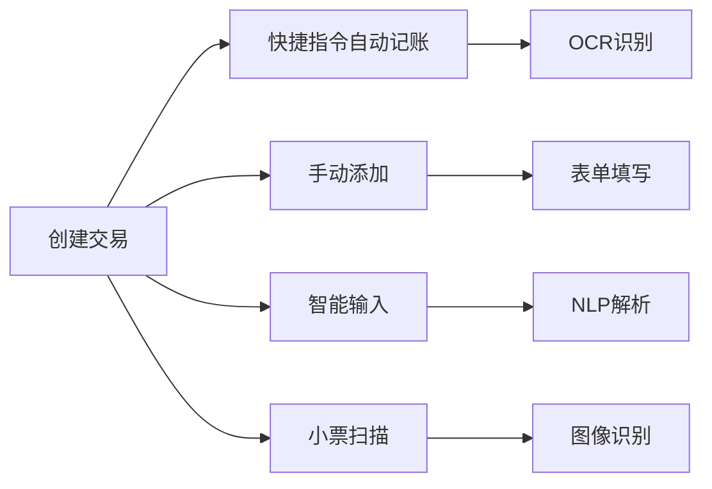
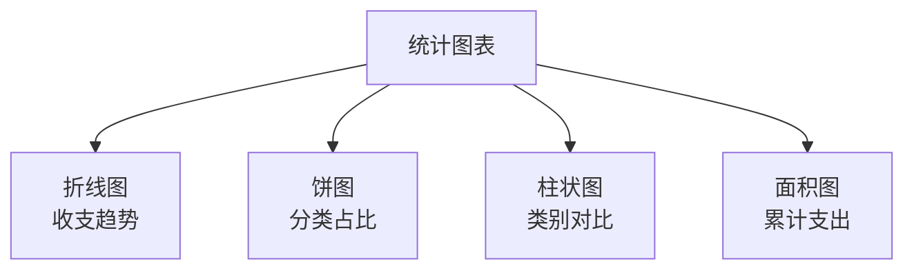

# 基本概念

在开始使用 AutoBookkeeping 之前，让我们了解一些核心概念。这将帮助你更好地理解应用的工作原理。

## 💰 交易记录 (Transaction)

**交易记录** 是应用中最基础的数据单元，代表一次消费或收入。

### 交易的组成部分

每笔交易包含以下信息：

| 字段 | 说明 | 是否必填 | 示例 |
|------|------|---------|------|
| **金额** | 交易金额 | ✅ 必填 | ¥35.00 |
| **类型** | 支出或收入 | ✅ 必填 | 支出 |
| **分类** | 消费类别 | ✅ 必填 | 餐饮美食 |
| **商家** | 商家名称 | ⭕ 可选 | 麦当劳 |
| **时间** | 交易时间 | ✅ 必填 | 2024-11-19 12:30 |
| **备注** | 额外说明 | ⭕ 可选 | 午饭 |

### 交易类型

#### 💸 支出 (Expense)

日常生活中花出去的钱

**示例**：
- 🍜 餐饮消费
- 🚇 交通出行
- 🛒 购物娱乐
- 💊 医疗保健
- 🏠 房租水电

#### 💰 收入 (Income)

获得的各类收入

**示例**：
- 💼 工资奖金
- 💸 投资收益
- 🎁 红包礼金
- 📈 理财分红
- 💵 其他收入

### 交易来源

AutoBookkeeping 支持多种方式创建交易：

## 📁 分类 (Category)

**分类** 用于组织和管理交易，帮助你了解钱花在哪些方面。

### 系统预设分类

应用内置了常用的分类，涵盖日常生活的各个方面：

#### 支出分类

**🍜 餐饮美食**
- 早餐、午餐、晚餐
- 外卖、快餐
- 饮料、咖啡

**🚗 交通出行**
- 地铁、公交
- 打车、滴滴
- 加油、停车

**🛒 购物消费**
- 服装鞋帽
- 日用百货
- 数码电子

**🏠 居住缴费**
- 房租房贷
- 水电燃气
- 物业费用

**📱 通讯网络**
- 话费充值
- 宽带费用
- 流量套餐

**🎬 文娱休闲**
- 电影演出
- 游戏充值
- 健身运动

**💊 医疗健康**
- 看病就医
- 买药
- 体检保健

**📚 学习教育**
- 图书资料
- 课程培训
- 考试报名

**✈️ 旅游度假**
- 机票酒店
- 景点门票
- 旅游花费

**👪 人情往来**
- 红包礼金
- 请客吃饭
- 送礼

#### 收入分类

- 💼 **工资收入** - 固定工资、奖金
- 📈 **投资理财** - 股票、基金、理财产品
- 💸 **兼职收入** - 副业、外快
- 🎁 **红包礼金** - 收到的红包、礼金
- 💰 **其他收入** - 其他来源的收入

### 自定义分类

除了系统预设，你还可以创建自己的分类：

1. 进入 **设置 → 分类管理**
2. 点击 **添加分类**
3. 设置以下内容：
   - 📝 分类名称（如"宠物开销"）
   - 🎨 分类图标（从 100+ 图标中选择）
   - 🌈 分类颜色
   - 🔤 关键词（帮助 AI 识别）

::: tip 关键词的作用
设置关键词后，当交易描述中包含这些词时，AI 会自动选择对应分类。

**示例**：为"宠物开销"添加关键词："猫粮"、"狗粮"、"宠物医院"
:::

## 💵 预算 (Budget)

**预算** 帮助你控制支出，避免过度消费。

### 预算类型

**📅 月度预算**
- 设置每月总支出限额
- 追踪每月消费进度
- 超支预警

**📁 分类预算**
- 为单个分类设置限额
- 如：餐饮 ¥1500/月
- 精细化管理

**🎯 总预算**
- 设置所有支出的总限额
- 全局把控

### 预算状态

预算会根据实际支出显示不同状态：

| 状态 | 说明 | 进度 |
|------|------|------|
| 🟢 **安全** | 支出正常 | < 70% |
| 🟡 **注意** | 接近限额 | 70% - 90% |
| 🟠 **警告** | 即将超支 | 90% - 100% |
| 🔴 **超支** | 已超出预算 | > 100% |

### 预算周期

- **每日预算** - 适合严格控制
- **每周预算** - 适合周计划
- **每月预算** - 最常用
- **每年预算** - 长期规划

## 📊 统计分析

AutoBookkeeping 提供多维度的数据分析。

### 分析维度

**时间维度**
- 日、周、月、年
- 自定义时间范围

**分类维度**
- 各分类占比
- 分类趋势对比

**金额维度**
- 总收入 / 总支出
- 净收入（收入 - 支出）
- 平均每日支出

### 图表类型

## 🤖 智能功能

AutoBookkeeping 的核心竞争力在于智能化。

### 智能分类

基于 CoreML 的机器学习模型，自动推断交易分类。

**工作原理**：
1. 提取商家名称、交易描述
2. 匹配关键词库
3. 使用 ML 模型推理
4. 返回最可能的分类

**准确率**：
- 初始准确率：~80%
- 使用越多，准确率越高
- 用户修正后会自动学习
- 最高可达 95%+

### OCR 识别

从支付截图中提取信息。

**可识别内容**：
- ✅ 交易金额
- ✅ 商家名称
- ✅ 交易时间
- ✅ 支付方式

**支持平台**：
- 微信支付
- 支付宝
- 银行 App

### 自然语言输入

用说话的方式记账。

**示例**：
> "今天中午在肯德基花了42块吃午饭"

**自动解析**：
- 💵 金额：42.00
- 🏪 商家：肯德基
- 📁 分类：餐饮美食
- 🕐 时间：今天中午
- 📝 备注：午饭

## 🔄 数据同步

### 本地存储

默认情况下，所有数据存储在 iPhone 本地：

- 使用 SwiftData 框架
- 数据加密存储
- 不占用 iCloud 空间
- 完全离线可用

### iCloud 同步（可选）

启用后可以：

- ☁️ 多设备数据同步
- 🔄 自动备份到 iCloud
- 📱 在其他设备访问数据
- 🔒 端到端加密

::: warning 注意
- 需要登录 iCloud 账号
- 需要足够的 iCloud 存储空间
- 同步需要网络连接
:::

## 🎯 关键概念总结

| 概念 | 定义 | 用途 |
|------|------|------|
| **交易** | 一次收入或支出记录 | 记录财务流水 |
| **分类** | 交易的类别标签 | 组织和分析数据 |
| **预算** | 消费限额设置 | 控制支出 |
| **统计** | 数据可视化分析 | 了解消费习惯 |
| **AI** | 智能识别和分类 | 提高效率 |

## 📚 延伸阅读

现在你已经了解了基本概念，可以继续学习：

- [快速记账教程](/tutorials/quick-add) - 学习如何快速创建交易
- [分类管理](/features/categories) - 深入了解分类系统
- [预算管理](/features/budget) - 学习设置和管理预算
- [统计分析](/features/statistics) - 掌握数据分析功能

---

::: tip 💡 记住
理解这些概念后，使用 AutoBookkeeping 会更加得心应手。不用担心，在实际使用中你会很快熟悉它们！
:::

