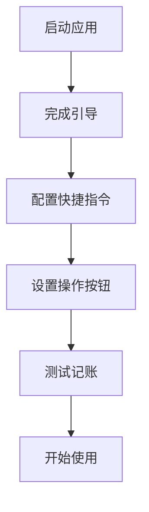

# 首次使用

恭喜你完成了 AutoBookkeeping 的安装！本指南将带你完成首次配置，快速开始使用。

## 🎯 配置流程概览



预计完成时间：**5-10 分钟**

## 📱 步骤 1：启动应用

1. 在主屏幕上找到 **AutoBookkeeping** 图标（绿色钱包图标）
2. 点击图标启动应用
3. 首次启动时会显示欢迎画面

## 🌟 步骤 2：完成新手引导

应用会自动显示新手引导，介绍核心功能：

### 第 1 页：欢迎使用

<div class="feature-intro">

**无感记账，从此开始**

- 了解应用的核心理念
- 查看主要功能介绍

👉 点击 **继续** 进入下一步

</div>

### 第 2 页：工作原理

<div class="feature-intro">

**如何实现 2 秒记账？**

1. 支付后停留在结果页面
2. 按下操作按钮（或其他触发方式）
3. 快捷指令自动截图识别
4. AI 智能分类并保存

👉 点击 **继续** 了解更多

</div>

### 第 3 页：权限请求

<div class="feature-intro">

**需要的权限**

应用会请求以下权限：

- 📸 **照片库访问** - 用于识别支付截图
- 🔔 **通知权限** - 发送记账成功提醒
- 🎤 **Siri 与搜索** - 启用语音记账

👉 点击 **允许** 授予权限

</div>

::: warning 重要提示
建议授予所有权限以获得完整功能体验。你可以随时在系统设置中调整权限。
:::

### 第 4 页：快捷指令配置

<div class="feature-intro">

**一键添加快捷指令**

- 点击 **立即配置** 跳转到设置页面
- 或选择 **稍后配置** 手动设置

👉 建议选择 **立即配置**

</div>

## ⚡ 步骤 3：配置快捷指令

这是最重要的一步，决定了记账的便捷程度。

### 方式一：一键添加（推荐）✨

1. 在引导页面点击 **立即配置**（或在设置页面点击"一键添加快捷指令"）
2. 系统会打开快捷指令 App
3. 显示 **"添加快捷指令"** 对话框
4. 点击 **添加快捷指令** 按钮
5. 等待几秒，配置完成

::: tip 成功标志
配置成功后会看到：
- ✅ 快捷指令 App 中出现 "AutoBookkeeping 记账" 快捷指令
- ✅ AutoBookkeeping 设置页面显示 "已配置"
:::

### 方式二：手动配置

如果一键添加失败，可以手动创建快捷指令：

详细步骤请参考：[快捷指令设置教程](/tutorials/shortcuts-setup)

## 📲 步骤 4：设置触发方式

配置好快捷指令后，选择你喜欢的触发方式：

### iPhone 15 Pro / 16 Pro - 操作按钮（推荐）⭐

1. 打开 iPhone **设置** 应用
2. 下滑找到 **操作按钮**
3. 选择 **快捷指令**
4. 点击 **选择快捷指令**
5. 找到并选择 **"AutoBookkeeping 记账"**
6. 完成！

::: tip 操作按钮优势
- ⚡ 最快的触发方式（1秒内完成）
- 🎯 单手即可操作
- 💪 即使在锁屏状态也能使用
:::

### 其他 iPhone 机型 - 轻点背面

1. 打开 **设置 → 辅助功能**
2. 选择 **触控 → 轻点背面**
3. 选择 **轻点两下** 或 **轻点三下**
4. 找到并选择 **"AutoBookkeeping 记账"**

### 所有机型 - Siri 语音

直接对 Siri 说：

> "嘿 Siri，AutoBookkeeping 记账"

或设置自定义语音指令：

1. 打开快捷指令 App
2. 长按 "AutoBookkeeping 记账" 快捷指令
3. 点击 **详细信息**
4. 启用 **添加到 Siri**
5. 录制自定义短语，如 "记一笔"

### 桌面小组件（即将支持）

未来版本将支持直接从主屏幕小组件快速记账。

## 🧪 步骤 5：测试记账功能

现在来测试一下配置是否成功！

### 模拟真实场景

1. **准备测试环境**
   - 打开微信或支付宝
   - 随便找一个二维码（不用真的支付）
   - 截图一张支付结果页面（或使用任意截图）

2. **触发快捷指令**
   - iPhone 15 Pro：按下操作按钮
   - 其他机型：使用你配置的触发方式

3. **观察运行过程**
   - 快捷指令自动运行
   - 可能会看到短暂的处理动画
   - 等待通知弹出

4. **查看结果**
   - 收到 "记账成功" 通知 ✅
   - 打开 AutoBookkeeping 应用
   - 在交易列表中看到新记录

::: tip 测试成功标志
- ✅ 收到系统通知
- ✅ App 中出现新的交易记录
- ✅ 金额、商家、分类已自动填充
- ✅ 临时截图已自动删除
:::

### 如果测试失败？

如果没有成功创建记录，请检查：

1. ✅ 快捷指令是否正确添加
2. ✅ 照片库权限是否已授予
3. ✅ 通知权限是否已启用
4. ✅ 截图是否包含金额信息

详细故障排除请查看：[故障排除指南](/faq/troubleshooting)

## 🎨 步骤 6：了解主界面

测试成功后，让我们熟悉一下应用界面：

### 主界面布局

```
┌─────────────────────────────┐
│   📊 统计    💰 交易    ⚙️ 设置  │  ← 底部标签栏
├─────────────────────────────┤
│                             │
│  💰 交易列表                 │
│  ┌───────────────────────┐  │
│  │ 🍜 午饭 - ¥35.00      │  │  ← 交易记录卡片
│  │ 麦当劳 · 今天 12:30    │  │
│  └───────────────────────┘  │
│  ┌───────────────────────┐  │
│  │ 🚇 地铁 - ¥4.00       │  │
│  │ 上海地铁 · 今天 08:15  │  │
│  └───────────────────────┘  │
│                             │
│              [+]            │  ← 快速添加按钮
└─────────────────────────────┘
```

### 主要标签页

| 标签 | 功能 | 说明 |
|------|------|------|
| 📊 **统计** | 数据分析 | 查看收支趋势、分类占比、预算进度 |
| 💰 **交易** | 记录列表 | 查看所有交易记录，添加/编辑/删除 |
| ⚙️ **设置** | 应用设置 | 分类管理、通知设置、数据导出等 |

### 快速添加按钮

点击右下角的 **[+]** 按钮可以手动添加交易：

- 💸 **支出** - 日常消费记录
- 💰 **收入** - 工资、奖金等收入

## 📖 步骤 7：创建第一笔记录

让我们手动创建一笔记录来熟悉功能：

1. **点击 [+] 按钮**
2. **选择交易类型**：支出
3. **填写信息**：
   - 💵 **金额**：35.00
   - 🏪 **商家**：麦当劳（可选）
   - 📁 **分类**：餐饮美食
   - 🕐 **时间**：选择时间（默认为当前）
   - 📝 **备注**：午饭（可选）
4. **点击保存**

::: tip 智能功能提示
你也可以点击 **智能输入** 按钮，直接说：
> "今天中午在麦当劳花了35块吃午饭"

AI 会自动解析并填充所有字段！
:::

## ✅ 配置完成检查清单

在开始日常使用前，确认以下项目：

- [ ] ✅ 应用已安装并成功启动
- [ ] ✅ 已授予必要权限（照片、通知、Siri）
- [ ] ✅ 快捷指令已成功添加
- [ ] ✅ 触发方式已配置（操作按钮/轻点背面/Siri）
- [ ] ✅ 已完成测试记账
- [ ] ✅ 熟悉主界面和基本操作
- [ ] ✅ 成功创建第一笔手动记录

全部完成？恭喜你已经准备就绪！🎉

## 🚀 下一步

现在你已经完成了基础配置，可以：

1. **📚 学习更多功能**
   - [快速记账教程](/tutorials/quick-add)
   - [智能输入使用](/tutorials/smart-input)
   - [分类管理](/features/categories)

2. **⚙️ 个性化设置**
   - 自定义分类和图标
   - 设置月度预算
   - 配置通知提醒

3. **💡 最佳实践**
   - 每次支付后立即记账
   - 定期查看统计分析
   - 根据消费习惯调整预算

## 💬 需要帮助？

如果在配置过程中遇到问题：

- 📖 查看 [常见问题](/faq/general)
- 🔧 访问 [故障排除](/faq/troubleshooting)
- 💬 [提交反馈](https://github.com/XiaoLinZzz/Record-Money/issues)
- 📧 联系支持：your-email@example.com

---

::: tip 💡 温馨提示
记账贵在坚持！建议每天花 1 分钟查看一下当天的消费情况，慢慢就会养成良好的消费习惯。
:::

<style scoped>
.feature-intro {
  background: linear-gradient(135deg, #667eea 0%, #764ba2 100%);
  color: white;
  padding: 20px;
  border-radius: 12px;
  margin: 20px 0;
  box-shadow: 0 4px 12px rgba(0,0,0,0.1);
}

.feature-intro h4 {
  color: white;
  margin-top: 0;
}
</style>
