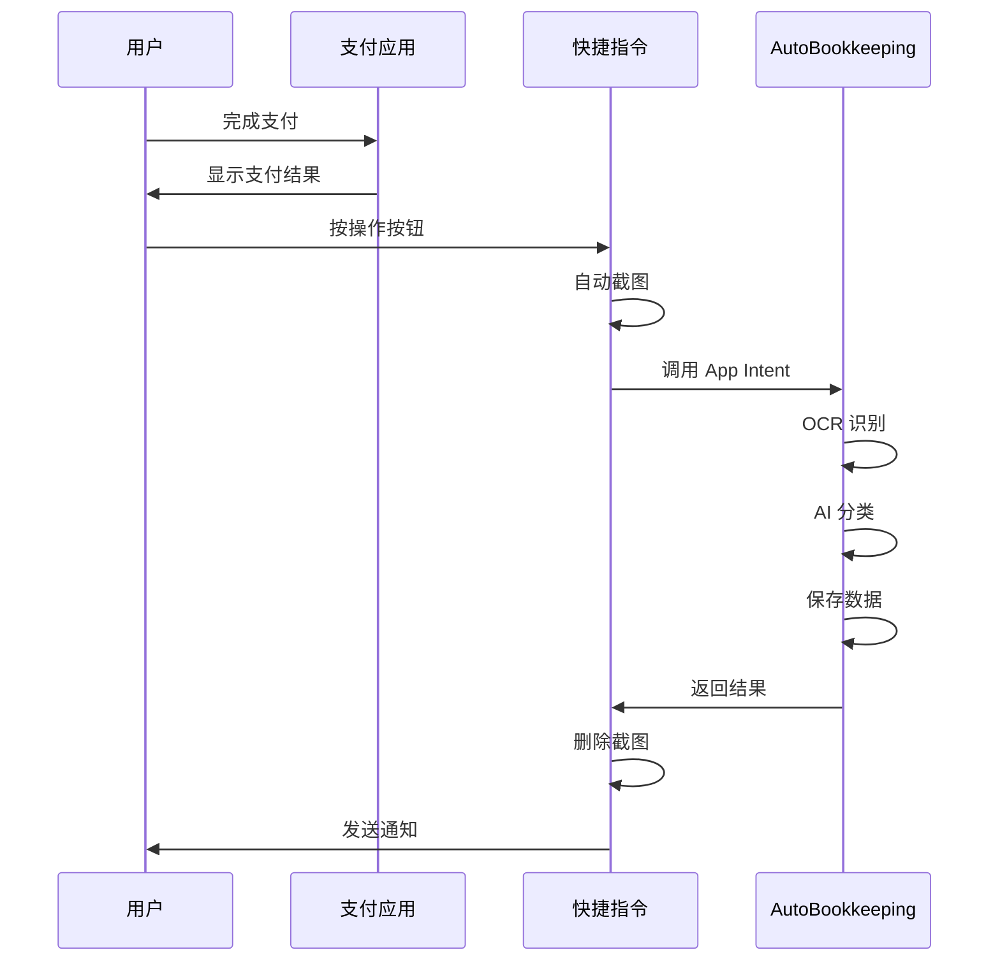

# 快速记账教程

本教程将手把手教你如何使用 AutoBookkeeping 的核心功能——**快捷指令自动记账**，实现 2 秒完成记账。

## 🎯 学习目标

完成本教程后，你将能够：

- ✅ 理解快速记账的工作原理
- ✅ 正确触发快捷指令
- ✅ 在不同场景下快速记账
- ✅ 处理常见问题

**预计时间**：10 分钟

## 📋 前置条件

在开始之前，请确保：

- [x] 已安装 AutoBookkeeping 应用
- [x] 已完成快捷指令配置（[配置教程](/tutorials/shortcuts-setup)）
- [x] 已设置触发方式（操作按钮/轻点背面/Siri）
- [x] 已授予照片库访问权限

::: tip 还没配置？
如果还未完成配置，请先查看 [首次使用指南](/getting-started/first-use)。
:::

## ⚡ 快速记账流程

### 完整流程图

### 标准流程

### 步骤 1：完成支付

在微信或支付宝完成支付操作。

**支持的支付应用**：
- ✅ 微信支付
- ✅ 支付宝
- ✅ 云闪付
- ✅ 美团
- ✅ 大众点评
- ✅ 其他显示金额的应用

### 步骤 2：停留在结果页

**重要**：不要立即退出支付结果页面！

确保页面上显示：
- 💰 支付金额
- 🏪 商家名称（如果有）
- ✅ 支付成功标识

**停留时间**：约 2-3 秒

::: warning 注意
如果过早退出，快捷指令可能无法正确识别金额。
:::

### 步骤 3：触发快捷指令

根据你的设备和配置，使用对应的触发方式：

#### iPhone 15 Pro / 16 Pro

**按操作按钮**
- 位置：机身左侧上方
- 按压：短按（约 0.5 秒）
- 反馈：震动反馈

#### 其他 iPhone

**轻点背面**（如已配置）
- 轻点：快速连续两下或三下
- 位置：手机背面 Apple Logo 附近
- 力度：适中，不要太重或太轻

**呼叫 Siri**（所有机型）
- 语音指令："嘿 Siri，AutoBookkeeping 记账"
- 或自定义短语："记一笔"

### 步骤 4：等待处理

快捷指令自动运行，你会看到：

1. **屏幕闪一下**（截图动作）
2. **快捷指令横幅**（顶部显示）
3. **处理中提示**（约 1-2 秒）
4. **完成通知**（"记账成功 ¥35.00"）

**整个过程**：约 2-3 秒 ⚡

### 步骤 5：查看结果

收到通知后，可以：

**立即查看**
- 点击通知横幅
- 跳转到 AutoBookkeeping
- 查看新创建的记录

**稍后查看**
- 继续当前操作
- 有空时打开 App 查看
- 记录已自动保存

## 🌟 实战示例

### 示例 1：超市购物

**场景**：在便利店买了35元的商品

1. 打开支付宝扫码付款
2. 支付成功，显示"支付成功 ¥35.00"
3. 停留在结果页面
4. 按下操作按钮（或轻点背面）
5. 收到通知："记账成功 ¥35.00 - 购物消费"

**耗时**：约 2 秒 ⚡

### 示例 2：餐厅就餐

**场景**：在麦当劳点餐花了42元

1. 微信扫码支付 ¥42.00
2. 支付结果页显示"已支付 麦当劳"
3. 保持页面不动
4. 说"嘿 Siri，记一笔"
5. 收到通知："记账成功 ¥42.00 - 餐饮美食 - 麦当劳"

**AI 识别**：
- ✅ 金额：42.00
- ✅ 商家：麦当劳
- ✅ 分类：餐饮美食（自动分类）

### 示例 3：交通出行

**场景**：坐地铁花了4元

1. 使用乘车码支付
2. 显示"扣款成功 ¥4.00"
3. 快速轻点手机背面两下
4. 听到确认提示音
5. 收到通知："记账成功 ¥4.00 - 交通出行"

**特点**：
- 🚇 地铁场景常见，AI 识别准确
- ⚡ 轻点背面最快（约 1 秒）

### 示例 4：外卖订餐

**场景**：美团点外卖 68 元

1. 美团支付成功
2. 订单详情显示金额
3. 按操作按钮
4. 自动记录
5. 通知："记账成功 ¥68.00 - 餐饮美食"

## 💡 进阶技巧

### 技巧 1：批量记账

如果有多笔待记录的消费：

1. 找到所有支付成功的截图/通知
2. 逐个打开查看
3. 每个都触发一次快捷指令
4. 快速完成批量记账

**效率对比**：
- 传统方式：5 笔 × 30秒 = 2.5 分钟
- AutoBookkeeping：5 笔 × 3秒 = 15 秒

### 技巧 2：提高准确率

确保 OCR 识别准确：

**✅ 做到**：
- 等待页面完全加载
- 确保金额清晰可见
- 保持屏幕亮度适中
- 不要遮挡重要信息

**❌ 避免**：
- 过早退出支付页面
- 在加载中就触发
- 屏幕亮度过暗
- 有弹窗遮挡金额

### 技巧 3：处理复杂场景

**多个金额同时显示**：
- AutoBookkeeping 会识别最大的金额
- 建议手动确认是否正确

**拼团/多人支付**：
- 识别的是你实际支付的金额
- 如需记录总额，手动修改

**优惠券抵扣**：
- 记录的是实付金额
- 如需记录原价，在备注中说明

### 技巧 4：不同时间记账

**实时记账**（推荐）：
- 支付后立即记录
- 准确率最高
- 不容易忘记

**延迟记账**：
- 保存支付成功截图
- 稍后打开截图
- 在截图页面触发快捷指令

**集中记账**：
- 一天结束后统一处理
- 从微信/支付宝账单逐个记录
- 适合忘记实时记账的情况

## ⚙️ 个性化设置

### 设置默认分类

对于经常使用的分类，可以设置为默认：

1. 进入 **设置 → 智能分类**
2. 选择 **默认分类**
3. 当 AI 无法判断时使用默认分类

### 调整识别灵敏度

1. 进入 **设置 → OCR 设置**
2. 调整 **识别灵敏度**
   - 高：识别更多内容，可能有误
   - 中：平衡准确率和识别率（推荐）
   - 低：只识别高置信度内容

### 启用二次确认

如果担心自动记账出错：

1. 进入 **设置 → 快捷指令**
2. 启用 **记账前确认**
3. 每次记账前会弹出确认对话框

::: warning 注意
启用确认后会增加 5-10 秒的操作时间，降低"无感记账"体验。
:::

## ❓ 常见问题

### 为什么没有自动记账？

**可能原因**：
1. 快捷指令未正确配置
2. 照片权限未授予
3. AutoBookkeeping 未在后台运行
4. 屏幕上没有可识别的金额

**解决方法**：
- 检查快捷指令是否存在
- 前往设置检查权限
- 先打开一次 App
- 确保停留在支付结果页

### OCR 识别的金额不对

**可能原因**：
- 页面上有多个金额
- 识别了优惠金额而非实付
- 光线或亮度问题

**解决方法**：
- 编辑记录修正金额
- 调整屏幕亮度
- 等待页面完全加载后再触发

### 分类不准确

**原因**：AI 还在学习中

**解决方法**：
1. 手动修改为正确分类
2. AI 会从修改中学习
3. 多次修正后准确率提升
4. 添加关键词提示 AI

### 没有收到通知

**检查**：
1. 通知权限是否开启
2. 勿扰模式是否启用
3. 通知设置是否正确

**解决**：
- 前往 **设置 → 通知 → AutoBookkeeping**
- 确保允许通知
- 选择通知样式

## 📊 效率对比

看看 AutoBookkeeping 节省了多少时间：

| 场景 | 传统记账 | AutoBookkeeping | 节省时间 |
|------|---------|----------------|---------|
| 单笔记账 | 30 秒 | 2 秒 | 28 秒 |
| 每天 5 笔 | 2.5 分钟 | 10 秒 | 2.3 分钟 |
| 每月 150 笔 | 75 分钟 | 5 分钟 | **70 分钟** |
| 每年 1800 笔 | 15 小时 | 1 小时 | **14 小时** |

**一年节省 14 小时！** ⏰

## 🎓 下一步学习

掌握快速记账后，继续探索：

- [智能输入](/tutorials/smart-input) - 用说话的方式记账
- [扫描小票](/tutorials/scan-receipt) - 拍照识别消费信息
- [设置预算](/tutorials/set-budget) - 控制支出
- [分类管理](/features/categories) - 自定义分类

---

::: tip 💡 温馨提示
快速记账的关键是**及时**！支付后立即记录，不要拖延。坚持一周后，你会发现这已经成为自然的习惯。
:::

